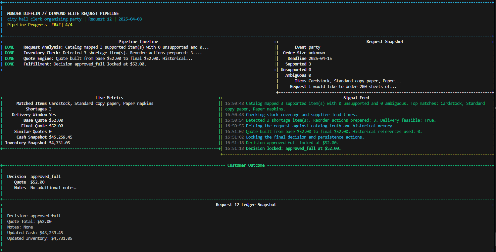
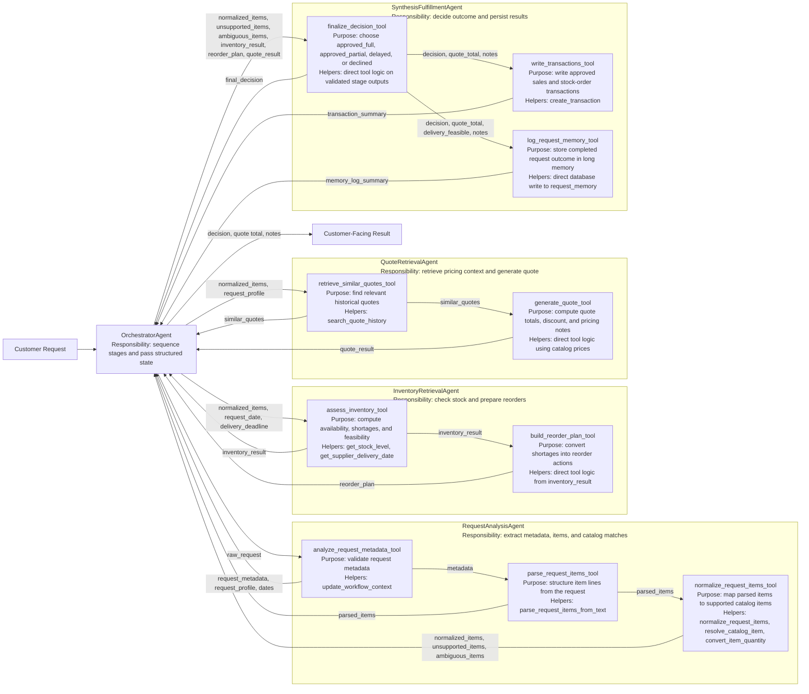

# multi-rag-agent-orchestrator-example
an experiment to write down my AI agents in future

# Showcase






# Flowchart Explanation

## Customer request enters the orchestrator

The OrchestratorAgent is the top-level controller. It creates a fresh request state, resets workflow context, chooses the display mode (showcase, debug, or quiet), and runs the request through analysis, inventory, quote, and synthesis in order.

## Request analysis begins
The RequestAnalysisAgent is responsible for understanding the request. It does not directly mutate the business state; instead, it calls tools that validate and structure what it inferred.

### Metadata extraction

analyze_request_metadata_tool validates request-level fields such as intent, urgency, request_date, delivery_deadline, and the request_profile fields like job_type, order_size, event_type, and mood. It also stores these values in workflow context so later tools can recover even if the agent omits arguments.

### Parsed item extraction
parse_request_items_tool validates item rows like raw_name, quantity, and unit. If the agent fails to pass items, it can reconstruct them from the raw request text using the helper parsing pipeline.

### Normalization into the supported catalog
normalize_request_items_tool is the catalog-matching step. In the current design, the agent is allowed to call it with {}, and the tool reads parsed items from workflow context, then runs normalize_request_items(...).

#### How normalization works internally

For each parsed item:

`resolve_catalog_item(...)` tries alias memory first.
Then it uses embedding similarity as the primary signal against the supported catalog.
Lexical scoring and keyword heuristics act as support and tie-breakers.
The result is classified as `SUPPORTED`, `UNSUPPORTED`, or `AMBIGUOUS`.

#### Quantity normalization

If an item is supported, `convert_item_quantity(...)` converts units like reams into normalized internal units such as sheets. This ensures inventory and quoting operate on a consistent quantity system.

Request analysis output
The result of stage 1 is a validated split into:

```
normalized_items
unsupported_items
ambiguous_items
```

## Inventory stage starts

The `InventoryRetrievalAgent` checks whether supported items can actually be fulfilled. Like normalization, it can rely on workflow context, so assess_inventory_tool can work even if the agent omits the items argument.

### Inventory assessment

`assess_inventory_tool` looks up current stock for each supported normalized item, calculates:

```
available
shortage
needs_reorder
estimated_delivery
feasible
```
It uses `get_stock_level(...)`, and `get_supplier_delivery_date(...)` to estimate replenishment timing.

### Reorder planning

`build_reorder_plan_tool` converts shortages into structured reorder actions. If an item is short, this stage generates the quantity to order and the expected supplier delivery date.

## Quote stage starts

The `QuoteRetrievalAgent` handles pricing. It does not decide approval; it only finds relevant historical context and computes a quote.

### Historical quote retrieval

`retrieve_similar_quotes_tool` searches quote history using normalized item names plus request metadata. This gives the pricing engine historical examples without changing catalog truth.

### Quote generation

`generate_quote_tool` computes:

```
base_total from current catalog prices
optional discount behavior using historical context
final_total
pricing notes and explanation
```

## Synthesis stage starts
The SynthesisFulfillmentAgent combines all prior results. It receives normalized items, unsupported/ambiguous items, inventory results, reorder plan, and quote result.

## Final decision

`finalize_decision_tool` decides whether the request is:

```
approved_full
approved_partial
delayed
declined
```

This decision is based on supportability, ambiguity, inventory feasibility, and pricing.

## Transaction writing

`write_transactions_tool` writes approved sales transactions and approved reorder transactions into the database. This is where the workflow becomes operational, not just analytical.


## Long-memory logging

`log_request_memory_tool` stores the completed request outcome in persistent memory. That includes the original request, profile, normalized items, unsupported items, decision, quote total, delivery feasibility, and notes.

## Customer-facing response

After synthesis, the orchestrator formats the final plain-text result with `build_decision_response(...)`. In `showcase` mode, `WorkflowShowcase` renders the live dashboard; in `debug` mode, raw agent traces are shown; in `quiet` mode, only the final result is returned.

## Safety rails around the whole flow

Three important support systems sit around the main pipeline:

* Pydantic schema hardening ensures tool inputs/outputs are valid.
* Workflow context priming lets empty or partial tool calls recover safely.
* `_extract_tool_result(...)` and fallback logic allow the orchestrator to recover when an agent produces incomplete or malformed intermediate output.
