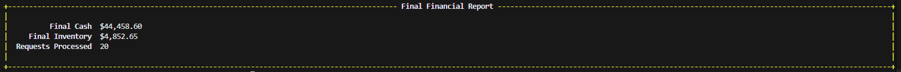
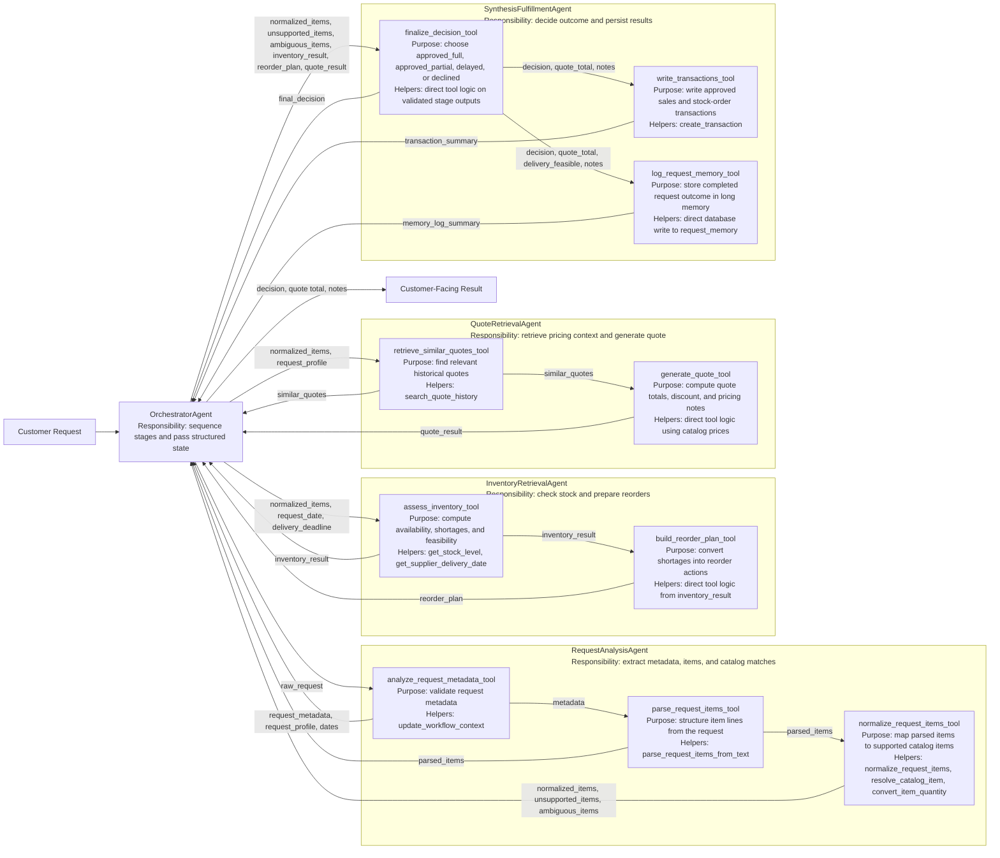

# multi-rag-agent-orchestrator-example
an experiment to write down my AI agents in future

This project implements a five-agent workflow for the fictional Munder Difflin paper company. The system reads customer quote and fulfillment requests, maps request items to the supported catalog, checks inventory feasibility, generates pricing, and produces a final decision while writing transactions and long-memory records.

## Showcase




The script supports three terminal modes:

- `showcase`: premium customer-facing dashboard
- `debug`: raw agent and tool trace output
- `quiet`: no live trace, only final result

Run the project with:

```powershell
cd C:\Users\Thinkpad\Documents\course_5\bambam\project
pip install -r requirements.txt
python .\project_starter.py
```

To switch modes:

```powershell
$env:MUNDER_DISPLAY_MODE='debug'
python .\project_starter.py
```

## Agent Workflow Diagram



## Architecture Reflection

The architecture uses one orchestrator plus four specialist agents because the project constraints allow at most five agents, and the workflow naturally separates into four business functions: request understanding, inventory reasoning, quote generation, and final fulfillment. This separation keeps responsibilities clear and prevents overlap. The request-analysis agent handles unstructured customer text, which is the most LLM-heavy part of the system. The inventory agent is responsible only for feasibility and reorder planning. The quote agent focuses on historical pricing context and quote generation. The synthesis agent is the only component allowed to make the final approval decision and persist the result.

The orchestrator was chosen as the control layer so that no specialist agent needs to understand the entire business process. Instead, each agent returns structured outputs through tools, and the orchestrator passes validated state from one stage to the next. This design makes the flow easier to debug and easier to explain: request analysis creates structured demand, inventory evaluates feasibility, quote produces price, and synthesis combines both into a business decision.

The request-analysis stage uses three tools because the incoming request contains three different kinds of information: metadata, raw item lines, and normalized catalog mappings. The normalization tool was designed to rely on embeddings-backed similarity plus lexical scoring because customer phrasing is variable and future requests may not match exact catalog wording. The inventory and quote stages are separated because they solve different business problems even though they use the same normalized item list as input. This also makes it possible to improve pricing logic later without changing inventory logic, or vice versa.

The synthesis stage exists so that the final decision is made only after all supporting evidence is available. That avoids premature approval decisions in upstream agents and keeps database writes centralized. The result is a pipeline where each agent has a distinct role, each tool has a clear purpose, and the orchestrator owns sequencing and state flow.

## Workflow Explanation

The workflow begins when the `OrchestratorAgent` receives a customer request and creates a fresh request state. It sends the request to the `RequestAnalysisAgent`, which extracts metadata, parses line items, and normalizes those items to the supported catalog. Once normalized items exist, the orchestrator passes them to the `InventoryRetrievalAgent`, which checks stock levels, shortages, reorder needs, and delivery feasibility. In parallel business terms, the same normalized items also feed the `QuoteRetrievalAgent`, which retrieves similar historical quotes and generates a structured price.

After inventory and quote outputs are available, the orchestrator sends everything to the `SynthesisFulfillmentAgent`. That final agent decides whether the request should be `approved_full`, `approved_partial`, `delayed`, or `declined`. It then writes approved sales and stock-order transactions and logs the completed request outcome to long-term memory. The final output shown to the customer is a concise decision, quote total, and note summary.

## Performance Evaluation

The latest [test_results.csv](test_results.csv) contains 20 processed sample requests. The evaluation results show:

- `9` requests changed the cash balance
- `9` requests were `approved_full`
- `8` requests were `approved_partial`
- `17` total requests were fulfilled if full and partial approvals are both counted
- `3` requests were not fulfilled, all with `delayed` decisions

The unfulfilled requests were not random failures. Their notes show business reasons that are consistent with the workflow:

- request `13`: supported items missed the requested deadline
- request `15`: some items were unsupported and another supported item missed the deadline
- request `18`: multiple supported items missed the requested deadline

These results are a strength because they show that the system does not approve every request blindly. It can still fulfill many requests successfully, but it also blocks or delays requests when inventory timing or catalog support makes fulfillment unsafe.

## Strengths Of The Implemented System

One clear strength is the separation of concerns. Because the workflow is divided into request analysis, inventory, quote, and synthesis, each stage is easier to reason about and can be tested independently. Another strength is the normalization pipeline. Embeddings-backed similarity allows the system to map flexible customer phrasing such as paper descriptors and variants into the supported catalog instead of requiring exact phrase matches.

The evaluation results also show that the system performs real business actions. Cash balances change across multiple requests, approved requests write transactions, and delayed requests remain documented with reasons.

## Future Improvements

1. Add a clarification loop for ambiguous or unsupported items. Right now, ambiguous or unsupported cases become notes in the final decision. A stronger version of the system could ask a follow-up question, suggest the nearest supported alternatives, and re-run the workflow with the clarified request.

2. Improve historical quote retrieval and ranking. The current quote retrieval stage uses search terms from normalized items and request metadata, which works, but it could be improved with semantic similarity over historical quote text and stronger weighting for event type, order size, and item overlap.

3. Refine fulfillment timing and supplier planning. Delivery feasibility is currently based on stock levels and supplier date estimation, but the model could be extended with supplier-specific lead times, reorder cost optimization, and prioritization rules for partial fulfillment.

## Submission Notes

This repository includes:

- the implemented agent workflow in [project_starter.py](project_starter.py)
- the workflow diagram and explanation in this README
- the recorded sample-run results in [test_results.csv](test_results.csv)
